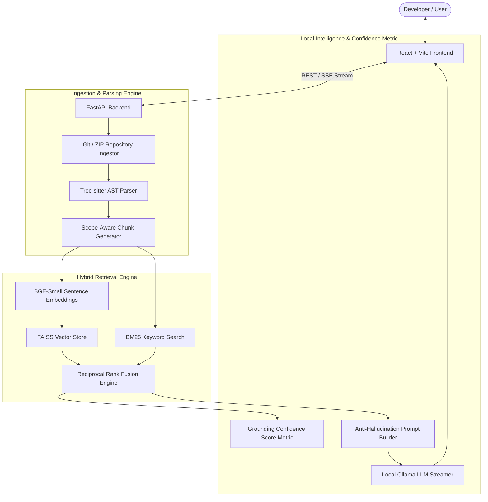

# CodeLens AI 🔍
> **An Intelligent, 100% Free & Local AI-Powered GitHub Repository Assistant**

CodeLens AI is a local, privacy-first developer assistant designed to help software engineers understand, navigate, document, and analyze large GitHub repositories. Built with **FastAPI**, **React + Vite**, **Tree-sitter AST parsing**, **FAISS vector search**, **BM25 keyword search**, and local **Ollama LLMs**, CodeLens AI provides grounded code exploration with zero paid APIs and zero cloud data leaks.

---

## 🌟 Key Features

* **Grounded RAG AI Chat**: Answers codebase architecture and implementation questions with line-level source citations (`file_path:start_line-end_line`) that open directly in a built-in syntax-highlighted inspector.
* **Syntax-Aware AST Code Chunking**: Uses **Tree-sitter** to chunk code along language AST boundaries (Classes, Functions, Methods, Scopes) instead of naive character/line splitting.
* **Hybrid Retrieval (FAISS + BM25 + RRF)**: Combines dense vector search (FAISS IndexFlatIP) with sparse keyword search (BM25Okapi) via **Reciprocal Rank Fusion (RRF)** for maximum retrieval recall.
* **Dynamic Grounding Confidence Metric**: Calculates a real-time **0–100% Grounding Confidence Score** (`0.6 × S_rrf + 0.4 × S_density`) to surface low-confidence retrievals (<60%) and prevent reliance on unsupported outputs.

* **Automated REST API Documentation**: Discovers HTTP route handlers (`@app.get`, `@router.post`, `express.get`) and parameters across source files.
* **Developer Onboarding Roadmaps**: Generates ordered reading lists and 5-step learning roadmaps for new repository contributors.
* **Module Dependency Networks**: Visualizes cross-file `import` / `require` dependency edges.
* **Code Smell & Tech Debt Analysis**: Automatically scans for long functions (>45 lines), God classes (>250 lines), missing docstrings, and pending `TODO`/`FIXME` comments.
* **SHA-256 Incremental Indexing**: Hash-based diffing that updates vector indices only for modified files without re-embedding untouched source code.

---

## 🏗️ System Architecture



---

## 🛠️ Tech Stack

| Component | Technologies |
|---|---|
| **Frontend** | React 18, Vite, TypeScript, Tailwind CSS, Lucide Icons, `react-syntax-highlighter`, `react-markdown` |
| **Backend API** | Python 3.10+, FastAPI, Uvicorn, AsyncIO, Pydantic |
| **Code Parsing** | Tree-sitter, `tree-sitter-languages` |
| **Vector & Keyword Retrieval** | FAISS (`faiss-cpu`), `sentence-transformers` (`BAAI/bge-small-en-v1.5`), `rank-bm25` |
| **Local LLM Engine** | Ollama (`qwen2.5-coder`, `deepseek-coder`, `llama3.1`) |
| **Storage & Database** | SQLite, Async SQLAlchemy, `aiosqlite` |
| **DevOps & Containerization** | Docker, Docker Compose |

---

## 🚀 Quick Start (Local Setup)

### Prerequisites
1. [Python 3.10+](https://www.python.org/) installed.
2. [Node.js v18+](https://nodejs.org/) installed.
3. [Ollama](https://ollama.com/) installed locally.

---

### Step 1: Start Ollama Engine
Pull the recommended lightweight coding model:
```bash
ollama pull qwen2.5-coder:1.5b
```

---

### Step 2: Start Backend (Terminal 1)
```bash
cd backend
pip install -r requirements.txt
python main.py
```
- **Backend API**: `http://localhost:8000`
- **Interactive Swagger Docs**: `http://localhost:8000/docs`

---

### Step 3: Start Frontend (Terminal 2)
```bash
cd frontend
npm install
npm run dev
```
- **Frontend Workspace**: Open `http://localhost:3000` in your web browser.

---

## 🐳 Docker Deployment

Alternatively, run the entire stack with Docker Compose:

```bash
docker compose up -d --build
```

- **Frontend**: `http://localhost:3000`
- **Backend**: `http://localhost:8000`

---

## ⚖️ License
Distributed under the **MIT License**. See `LICENSE` for more information.
